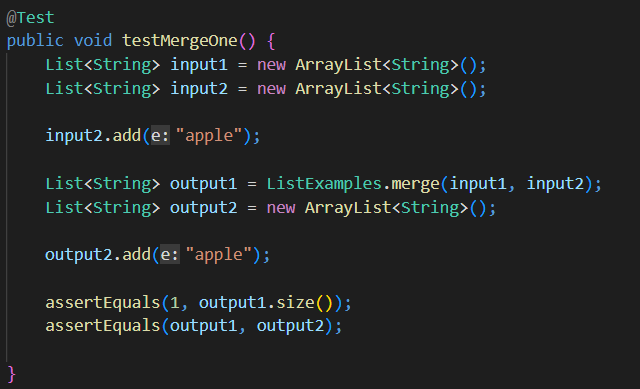

# Lab Report 2


## Simplest Search Engine- Source Code

```

import java.io.IOException;
import java.net.URI;
import java.util.ArrayList;

class Handler implements URLHandler {
    // The one bit of state on the server: a number that will be manipulated by
    // various requests.
    ArrayList<String> strs = new ArrayList<>();

    public String handleRequest(URI url) {

        System.out.println("Path: " + url.getPath());
        if (url.getPath().contains("/add")) {
            String[] parameters = url.getQuery().split("=");// splits at equals sign

            if (parameters[0].equals("s")) {
                strs.add(parameters[1]);
                System.out.print(strs.size());
                return String.format("The string that was added is %s", parameters[1]);
            } else
                return "404 Not Found!";
        } else if (url.getPath().contains("/search")) {
            String[] parameters = url.getQuery().split("=");// splits at equals sign

            if (parameters[0].equals("s")) {

                ArrayList<String> searchStrs = new ArrayList<>();
                for (int i = 0; i < strs.size(); i++) {
                    if ((strs.get(i)).contains(parameters[1])) {// if statement doesnt go through

                        searchStrs.add(strs.get(i));
                    }
                }
                String returnString = "The strings with the given substring are:\n";
                for (int i = 0; i < searchStrs.size(); i++) {
                    returnString += searchStrs.get(i);
                    returnString += "\n";
                }
                return returnString;
            } else
                return "404 Not Found!";
        } else if (url.getPath().equals("/")) {
            return ("hi");
        } else
            return "404 Not Found!";
    }
}

class SearchEngine {
    public static void main(String[] args) throws IOException {
        if (args.length == 0) {
            System.out.println("Missing port number! Try any number between 1024 to 49151");
            return;
        }

        int port = Integer.parseInt(args[0]);

        Server.start(port, new Handler());
    }
}
```
 
## Simplest Search Engine- Method Calls


- The code calls the main function in the SearchEngine class, which starts a server with a Handler object.
- In the Handler class, the handleRequest method is called, which takes the URL as the argument.
- In this case, the path contains add, so the code inside the first `if` statement is called.
- The parameter given is s, so the element given in the URL (door) is added to the list, and a prompt is given.
- The value of the ArrayList strs changes, with the given element (door) being added.
 


- Since the server has already been started, the handleRequest method is called, with the new URL as the argument.
- Once again, the path contains add, so the code inside the first `if` statement is called.
- The parameter given is s, so the element given in the URL (floor) is added to the list, and a prompt is given.
- The value of the ArrayList strs changes, with the given element (floor) being added after the existing element.


- Again, since the server has already been started, the handleRequest method is called, with the new URL as the argument.
- The path contains search, so the code inside the `else if` statement is called.
- The parameter given is s, so the code checks if the already added elements contain the substring given in the URL (oor).
- The website returns the elements in the list which contain the substring in the URL.
- The value of the ArrayList strs does not change.


## Bug Fixing- Arrays


- The test checks if the code reverses a two element integer array.
<br><br>

- The symptom shows that the reversed and expected arrays differed at the first element. 
- The reversed array's first element was zero, which was not present in the input array
<br><br>

- The bug is fixed by changing the line inside the `for` loop to:<br>`newArray[i]=arr[arr.length-i-1];`<br> and the `return `statement to: <br>`return newArray;`
<br><br>

**Explanation:**

- The code initialized a new empty array, and copied each element of the new array into the input array.
- The new array was a zero array, so all elements in the input array became zero.
- The code returns the input array, so it returns all elements as zero, hence the symptom of the arrays differing.
- This can be fixed using the above changes, where the statement inside the `for` loop copies each element of the input array into the reverse index of the new array.
- The reversed elements are now in the new array, so changed `return` statement returns the required array.


## Bug Fixing- Lists


- The test checks if the code successfully merges two arrays with single elements
<br><br>

- The symptom shows that Java ran out of memory. 
-  This possibly implies an infinite loop in the code.
<br><br>

- The bug is fixed by changing the increment inside the last `while` loop from index1 to index2 so the line looks like:
<br>`index2 += 1;`
<br><br>

**Explanation:**
- The existing code checks `index2` with `list2.size`, but then increments `index1` inside the loop.
- This results in the condition in the `while` loop never being fulfilled, and the loop iterating infinitely.
- Changing the increment to `index2` allows `index2` to reach a higher value than `list2.size`, and ends the loop when all the elements in list2 are copied into the result list.
