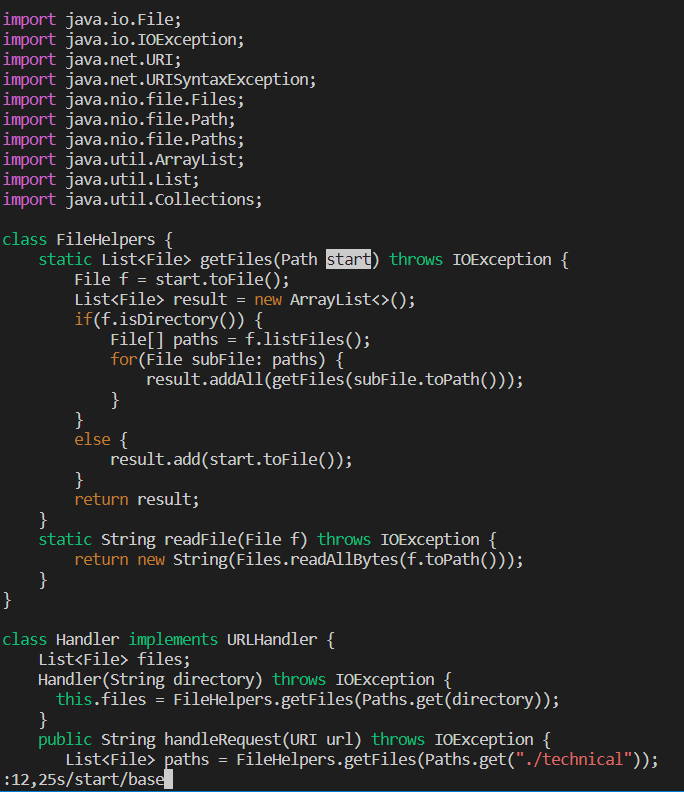
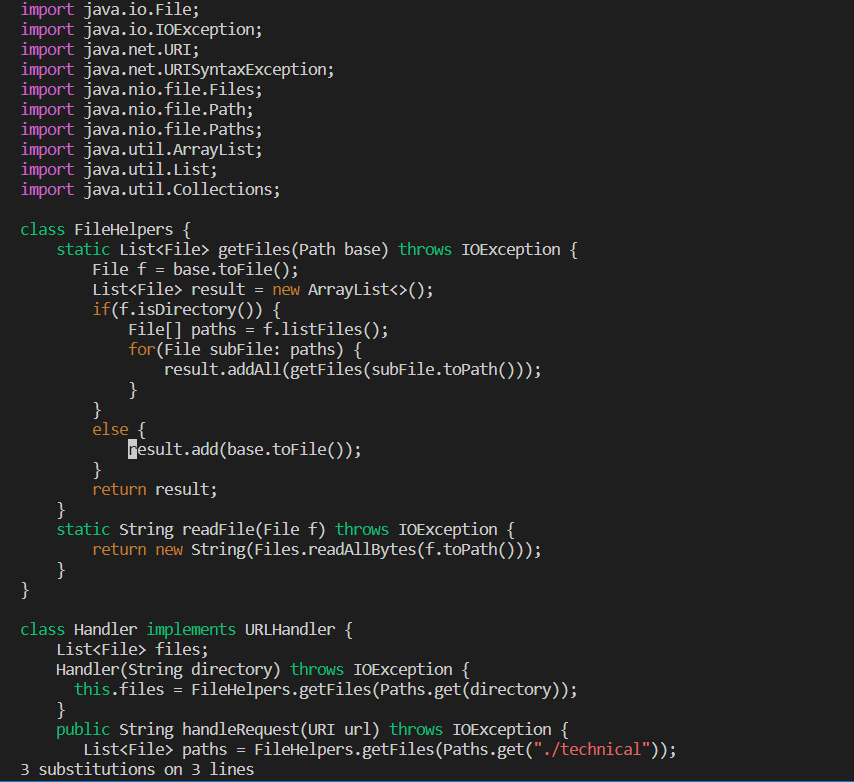
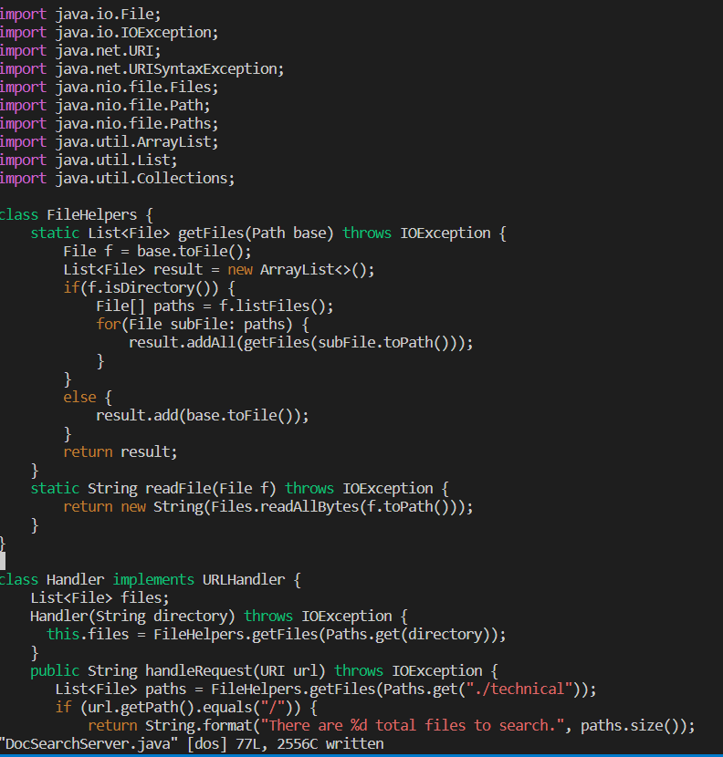

# Lab Report 4

## Part 1- Vim Commands

Changing the name of the `start` parameter and its uses in DocSearchServer.java to `base`
 
Shortest sequence of commands:

- `:12,25s/start/base`  ~ 19 keystrokes
 

The `:s` command is vim's search and replace command, which is the main command being used in this task. The first parameter used here is `12,25`, specifying the line bounds of the function in which the text is to be replaced. The `start` and `base` parameters are the value to be searched and the replaced value respectively. Vim highlights the first occurrence of the searched term, as seen in the screenshot.

 

- `<Enter>` ~ 1 keystroke
 

With the command being entered, the 3 occurrences of `start` are replaced with `base`, which is specified by vim at the bottom of the window.
 

- `:w<Enter>`~ 2 keystrokes
 

The `:w` command writes the changes made into the file, which is confirmed by the prompt at the bottom of the window.
 

 
- Total: 22 keystrokes

## Part 2- Vim Commands

- Making the edit and using scp:

Time: around 80 seconds

Difficulties: having multiple commands accessible, knowing file locations on local and remote machines, switching between remote and local machines

- Editing in Vim:

Time: around 30 seconds

Difficulties: finding errors and accessing parts of large code files

- Preferred Method:

Using Vim is definitely more convenient and faster to edit remote files.

However, VS Code's graphical interface and testing tools make writing code, organizing multiple files, and fixing bugs significantly easier.

Starting a new task and editing a large volume of code will be significantly more comfortable on VS Code, but making minor changes in a few lines will be much faster using Vim remotely.
      
  

