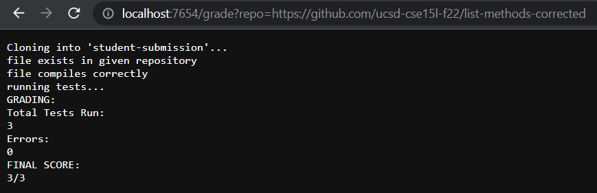

# Lab Report 5


## Code for grade.sh
```
# Create your grading script here

set -e

rm -rf student-submission
git clone $1 student-submission

cd student-submission


if [ -f ListExamples.java ]
then 
    echo "file exists in given repository"
else 
    echo "file does not exist in given repository"
    exit
fi

cp ../TestListExamples.java ./

set +e
javac -cp ".;../lib/hamcrest-core-1.3.jar;../lib/junit-4.13.2.jar" TestListExamples.java 2> ListCompile.txt
if [ $? -eq 0 ]
then 
    echo "file compiles correctly"
    
else 
    echo "file does not compile correctly"
    exit
fi

echo "running tests..."
java -cp ".;../lib/hamcrest-core-1.3.jar;../lib/junit-4.13.2.jar" org.junit.runner.JUnitCore TestListExamples > ListTestResult.txt
if [ $? -ne 0 ]
then 
    java -cp ".;../lib/hamcrest-core-1.3.jar;../lib/junit-4.13.2.jar" org.junit.runner.JUnitCore TestListExamples > ListTestResult.txt
fi

echo "GRADING:"
total_tests=$(grep -B 1 "Time" ListTestResult.txt | head -n +1 |grep -o '\.' | wc -l ) 
junit_errors=$(grep -B 1 "Time" ListTestResult.txt | head -n +1 |grep -o 'E' | wc -l)
echo "Total Tests Run:"

echo $total_tests
echo "Errors:"
echo $junit_errors

echo "FINAL SCORE:"
echo $((total_tests - junit_errors))"/"$total_tests

```

## Student Submissions

- Default code


- Corrected code with no errors



- File in incorrect location


## Script Trace: 

For the second case with the corrected code, the script trace is as follows:
- `git clone $1 student-submission`: <br><br>
  Standard output is `Cloning into 'student-submission'...` <br>
  Return code is zero, so the statement has no error.<br>

- `if [ -f ListExamples.java ]`: <br><br>
 The condition is true, as ListExamples.java exists in the file

- `echo "file exists in given repository"` <br><br>
 Standard output is `file exists in given repository` <br>
 Return code is zero, so the statement has no error.<br>

- `javac -cp ".;../lib/hamcrest-core-1.3.jar;../lib/junit-4.13.2.jar" TestListExamples.java 2> ListCompile.txt`<br><br>
Return code is zero, so the statement has no error. <br>
Standard error is empty. <br>
 
- `if [ $? -eq 0 ]` <br><br>
 The condition is true, as the previous command returns zero error code.<br>

- `echo "file compiles correctly"` <br><br>
 Standard output is `file compiles correctly` <br>
 Return code is zero, so the statement has no error.<br>

- `echo "running tests..."` <br><br>
 Standard output is `running tests...` <br>
 Return code is zero, so the statement has no error.<br>

- `java -cp ".;../lib/hamcrest-core-1.3.jar;../lib/junit-4.13.2.jar" org.junit.runner.JUnitCore TestListExamples > ListTestResult.txt`<br><br>
Return code is zero, so the statement has no error. <br>
Standard output is: <br>
```

JUnit version 4.13.2
...
Time: 0.016

OK (3 tests)

```

- `if [ $? -ne 0 ]` <br><br>
 The condition is false, as the previous command returns zero error code.<br>

- `echo "GRADING:"` <br><br>
 Standard output is `GRADING:` <br>
 Return code is zero, so the statement has no error.<br>

- `echo "Total Tests Run:"` <br><br>
 Standard output is `Total Tests Run:` <br>
 Return code is zero, so the statement has no error.<br>

- `echo "Errors:"` <br><br>
 Standard output is `Errors:` <br>
 Return code is zero, so the statement has no error.<br>

- `echo "FINAL SCORE:"` <br><br>
 Standard output is `FINAL SCORE:` <br>
 Return code is zero, so the statement has no error.<br>

- `echo $((total_tests - junit_errors))"/"$total_tests` <br><br>
 Standard output is `3/3` <br>
 Return code is zero, so the statement has no error.<br>


<br><br><br><br><br><br>
<br><br>


